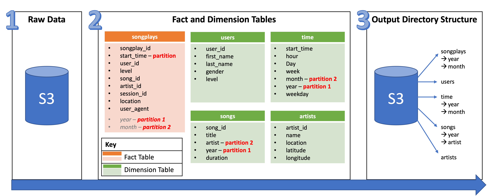

# Sparkify Data Lake

**Author: Jarome Leslie**

**Date: 2021-10-11**

## Introduction 
With the goal of expanding on Sparkify's existing data warehouse platform, this project involves the creation of a data lake using Apache Spark. First, the raw directories of JSON logs and song files are loaded from an AWS S3 bucket `s3://udacity-dend/`. Next the data is transformed into a five different tables, then written to partitioned parquet files to their respective table directories in the S3 bucket `s3://udacity-workspace/`.

With this tool, the Sparkify team is provided the greater capability of querying their data to ask and more efficiently answer questions about their expanding user base. 


## Database schema design and ETL process
The diagram below illustrates how the Sparkify database is modeled using the Star Schema and is centred around the *songplay* Fact table. Supporting its definition are four Dimension tables: *songs*, *users*, *artists*, and *time*. As highlighted in the diagram, the tables have been partioned in the following way: 
- the songplays table is partitioned by year and month, based on the start_time field; 
- the time table is partitioned by year and month; and
- the songs table is partitioned by year and artist.



## Files in repository
The source files provided include logs and song data. With respect to logs, event files for each day of November 2018 were provided in `json` format. In terms of songs, a subset of the **Million Song Dataset** is provided as a collection of files in `json` format.


## How to run the python scripts

1. To run the data pipeline, run the `etl.py` script:
    ```python etl.py```
